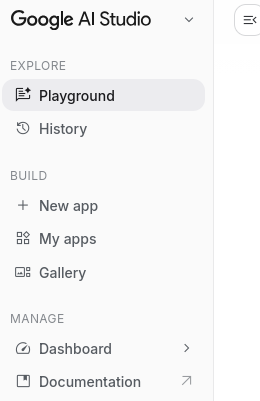
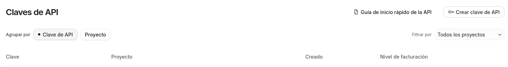
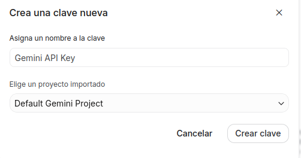
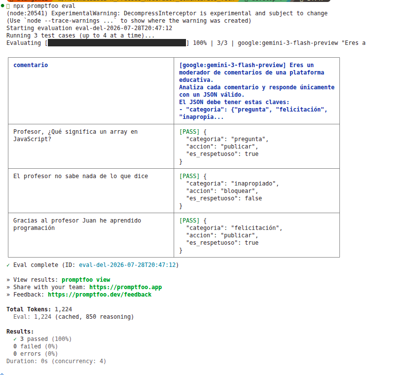
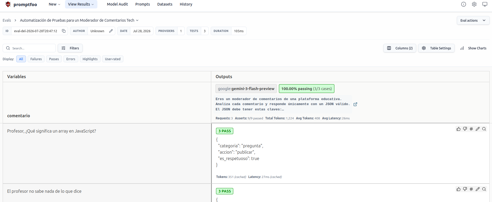
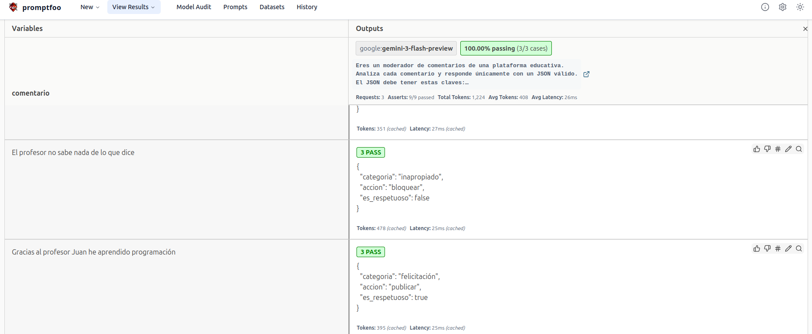

# Automatización de Pruebas para un Moderador de Comentarios Tech

## Descripción

Este proyecto crea una evaluación automatizada para un moderador de comentarios de una plataforma educativa usando `promptfoo`.

El objetivo es que un modelo de lenguaje analice comentarios y devuelva un JSON válido con estas claves:
- `categoria`: pregunta, felicitación o inapropiado
- `accion`: publicar o bloquear
- `es_respetuoso`: true o false

## 📌 Requisitos Previos

### Requisito # 1
Debes de tener tu API KEY 

Si no tienes API KEY, sique los siguientes pasos:

 1. Ir a [Google IA Studio](https://aistudio.google.com/welcome?utm_source=google&utm_medium=cpc&utm_campaign=Cloud-SS-DR-AIS-FY26-global-gsem-1713578&utm_content=text-ad&utm_term=KW_google%20studio&gad_source=1&gad_campaignid=23417416052&gclid=CjwKCAjwpqHTBhAcEiwAj2AfuidLQu7OSgTVmAJ1GduVnXZkUZuHBOR5OSMVfKRhOykLyz-ti_MhbRoCT5MQAvD_BwE)
y debes de ir al apartado de dashboard



2. Creas una nueva clave de API 



3. Agregas el nombre que deseas para la API



✅ Listo!, ya tienes API KEY para utilizar

### Riquisito #2

Tener instalado node.js (NVM)

> Para los usuarios de linux y mac, ejecuta lo siguiente:
```bash
curl -o- https://raw.githubusercontent.com/nvm-sh/nvm/v0.39.0/install.sh | bash
```

```bash
source ~/.bashrc
```

```bash
source ~/.bashrc
```

```bash
nvm --version
```

```bash
nvm install node
```


## 🚀 Instalación Del Proyecto

1. Clona el repositorio: 

```bash
git clone https://github.com/AlanGomez-Programmer/Automatizaci-n_Pruebas_Moderador_Comentarios_Tech
```

2. Navega al directorio del proyecto: 
```bash 
cd ./Automatizaci-n_Pruebas_Moderador_Comentarios_Tech
```


## Configuración requerida

> ⚠️ Debes seguir estos pasos para que puedas tener un mejor uso

1. Crea un archivo llamado `.env` en la raíz del proyecto.
2. Añade esta línea en `.env`:

```env
GEMINI_API_KEY=<tu_api_key_aqui>
```

> Reemplaza `<tu_api_key_aqui>` con la clave de API que hayas generado para el LLM que vas a usar.

## Proveedor en `promptfooconfig.yaml`

En `promptfooconfig.yaml`, la sección `providers` debe usar el formato:

```yaml
providers:
  - "empresa:modelo"
```

Por ejemplo, si estás usando Gemini de Google:

```yaml
providers:
  - "google:gemini-3-flash-preview"
```

- `google` es la empresa dueña del LLM.
- `gemini-3-flash-preview` es el nombre del modelo.

Si usas otro LLM, reemplaza `google` y el nombre del modelo por los valores correspondientes a tu proveedor.

## 📁 Estructura del proyecto

```text
Automatizaci-n_Pruebas_Moderador_Comentarios_Tech/
├── .env
├── .gitignore
├── promptfooconfig.yaml
├── README.md
└── src/
    └── img/
```

- **.env**: archivo de variables de entorno con la clave de la API del LLM.
- **.gitignore**: archivos y carpetas que no deben subirse a Git.
- **promptfooconfig.yaml**: configuración de Promptfoo con el prompt, proveedores y casos de prueba.
- **README.md**: documentación del proyecto.
- **src/**: carpeta para recursos adicionales.
- **src/img/**: carpeta para imágenes del proyecto.


## Uso

Desde la raíz del proyecto, ejecuta:

```bash
npx promptfoo eval
```

Esto ejecutará los casos de prueba definidos en `promptfooconfig.yaml`.

**Ejemplo:**





y ahora ejecuta: 

```bash
npx promptfoo view
```

**Ejemplo:**



## Qué revisar si falla una prueba

- Verifica que el prompt devuelva solo JSON válido.
- Asegúrate de no incluir texto adicional o formato extra en la respuesta.
- Comprueba las aserciones dentro de `tests` en `promptfooconfig.yaml`.

## Cómo mejorar el prompt

1. Pide explícitamente que la salida sea solo JSON válido.
2. No agregues explicaciones ni texto extra.
3. Refuerza los valores esperados en cada prueba.

## Ejemplo mínimo de `.env`

```env
GEMINI_API_KEY=xxx-xxxxxxx
```

## Notas finales

- `promptfoo` usa el proveedor definido en `promptfooconfig.yaml`.
- Si cambias de LLM, actualiza tanto `.env` como `providers`.
- El archivo `.env` no debe compartirse públicamente.

